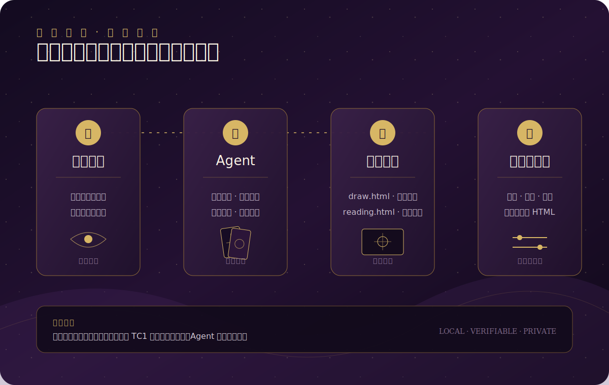

<div align="center">

#  森林密语

**一个面向中文对话的温柔塔罗反思 + 林间回信 Agent Skill**

*今晚就给自己一场不被打扰的小小仪式。*

[](LICENSE)
[](CHANGELOG.md)
[](https://www.skills.sh/?q=tarot-confessional)

</div>

---

## ✨ 为什么选择森林密语？

在这个快节奏的世界里，每个人都需要一个安全的角落，可以放下防备，说说心里话。

**森林密语** 不是算命工具，而是一个温柔的同行者：
- 它不会评判你的选择
- 它不会给你绝对的答案
- 它只是用象征的方式，帮你整理内心的纷扰

##   体验一下

<div align="center">

###   在线体验（无需安装）

**[  点击这里体验完整营销页 →](https://scott1743.github.io/tarot-confessional/)**

*包含抽牌演示、解读报告展示和一键安装指南*

</div>

---

##   核心功能

###   智能对话
Agent 会先倾听你的困扰，理解你真正想探索的问题，然后选择最合适的牌阵。

###   仪式感抽牌
在本地浏览器中完成安全随机抽牌，支持正逆位，生成可校验的抽牌码。整个过程充满仪式感，却不依赖任何网络服务。

###   深度解读
结合你的具体问题和牌面象征，先给出相对明确的核心答复，再说明逐牌依据、关键条件和可验证的下一步。报告可离线阅读、保存和打印。

###  ️ 安全边界
内置医疗、法律、财务、危机干预等安全边界，确保这个工具不会越界。

---

##   快速开始

### 方式一：通过 skills.sh 安装（推荐）

```bash
npx skills add Scott1743/tarot-confessional/skills/tarot-confessional
```

### 方式二：手动安装

1. 下载最新版本：[tarot-confessional-2.2.0.zip](https://github.com/Scott1743/tarot-confessional/releases/download/v2.2.0/tarot-confessional-2.2.0.zip)
2. 解压到你的 Agent skills 目录
3. 在对话中触发塔罗功能

---

##   使用示例

```
我最近在考虑要不要换工作，请用三张牌帮我梳理一下。
```

```
我想说说最近的人际关系，不一定要抽牌。
```

```
我和男朋友吵架了，想用塔罗看看我们之间到底怎么了。
```

---

##   设计理念

### 象征而非预测
塔罗牌是一面镜子，映照你内心的状态，而非预测未来的工具。

### 温柔而非评判
无论你问什么问题，这里都不会有道德审判，只有理解和支持。

### 私密而非公开
所有抽牌和解读都在本地完成，你的问题和牌面不会上传到任何服务器。

### 严谨而非神秘
虽然使用象征语言，但我们的代码和协议都是严谨可验证的。

##   密语回响

2.2.0 的「密语回响」可选联动 [Mneme](https://github.com/Scott1743/mneme)。首次使用时可以选择安装；安装后，只有在你允许时，解读才会参考相关的本地记录，并在报告后单独给出带来源的温和回应。未安装时抽牌与报告保持完整，报告最后只留一段可跳过的提示。

Mneme 的轻量安装包地址可通过 `FOREST_WHISPERS_MNEME_RELEASE_URL` 配置，默认指向 `mneme-2.2.0.zip`。森林密语 2.2.0 可自动发现 Codex、Claude、WorkBuddy 与 `.agents` 的标准 Skill 目录，并在本地服务确认 Mneme 和 bundle 都可用后自动激活整理按钮。所有保存仍需当次确认；“整理这次回响”只会运行只读审阅，不会自动写入你的记忆。Mneme 对本地文件的可选转换只使用用户已有的工具，从不在这条流程里自动安装软件。

---

##   技术架构



---

##   项目结构

```text
tarot-confessional/
├── skills/
│   └── tarot-confessional/  # 唯一可分发的 Skill 源
│       ├── SKILL.md         # Agent Skill 核心定义
│       ├── assets/          # HTML 页面和图片资源
│       ├── references/      # 牌组数据和解读指南
│       └── scripts/         # 构建和编解码脚本
├── introduction/            # 营销展示页
├── docs/                    # 设计文档
├── CHANGELOG.md             # 版本变更记录
└── README.md                # 本文件
```

---

##   设计文档

- [产品与技术总设计](docs/superpowers/specs/2026-07-12-tarot-confessional-product-design.md)
- [双 HTML 体验设计](docs/superpowers/specs/2026-07-12-tarot-html-experience-design.md)
- [抽牌码协议规范](skills/tarot-confessional/references/draw-code-protocol.md)
- [解读指南](skills/tarot-confessional/references/reading-guidance.md)

---

##   牌面艺术

采用 **钴蓝金线仪式塔罗** 视觉方向：
- 钴蓝与群青底场、古金几何线、强中轴对称
- 人物原型与物件象征并置，保留清晰的花色数量
- 78 张完整正位牌组，统一 768 × 1152 JPEG；逆位由运行时旋转正位图呈现

---

##  ️ 开发者指南

### 本地开发

```bash
# 克隆仓库
git clone https://github.com/Scott1743/tarot-confessional.git
cd tarot-confessional

# 打包 Skill
python3 scripts/package_skill.py --version 2.2.0

# 运行测试
python3 -m pytest tests/
```

### 贡献指南

提交改动前请阅读 [CONTRIBUTING.md](CONTRIBUTING.md) 和 [CODE_OF_CONDUCT.md](CODE_OF_CONDUCT.md)。

---

##   安全说明

本项目仅用于 **娱乐、自我反思和一般性情绪支持**，不能替代：
- ‍⚕️ 医生或心理咨询师的专业帮助
- ⚖️ 律师的法律建议
-   财务顾问的专业意见
-   紧急救援服务

如果你正在经历心理危机，请立即联系当地的专业心理援助热线。

---

##   许可证

本项目采用 [MIT License](LICENSE) 开源协议。

---

<div align="center">

**今晚，给自己十分钟的不被打扰。**

*森林密语，留给自己的一段林间回信。*

</div>
